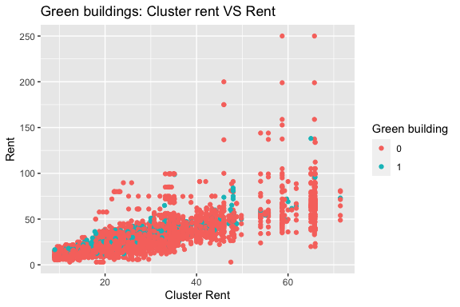
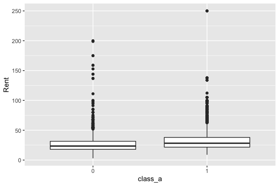
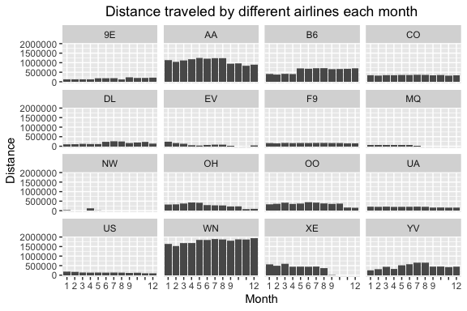
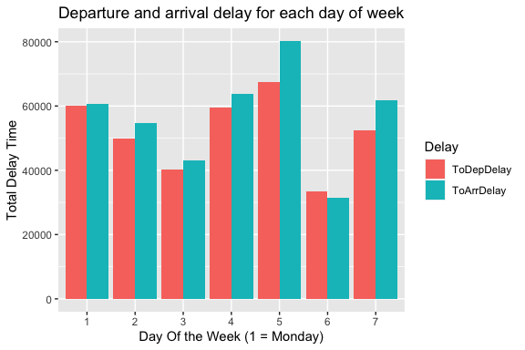
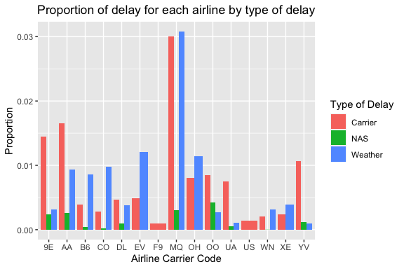
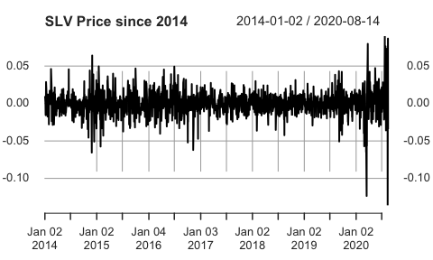

**Problem 1: Visual story telling: green buildings**
----------------------------------------------------

It does make sense to use the median rather than mean as the non-green
buildings have many outliers as suggested by the boxplot below

The stats guru is right about removing buildings with less than 10%
occupancy as based on the summary below. Within the group of buildings
that have only 10% occupancy, there is only one building with a green
rating. In addition, roughly half of the buildings have 3 stories and
very few buildings have a Class A designation. Hence we should remove
buildings with less than 10% occupancy as it may distort the analysis.

    ##  CS_PropertyID        cluster            size           empl_gr      
    ##  Min.   :     57   Min.   :   8.0   Min.   :  1624   Min.   :-1.490  
    ##  1st Qu.: 239800   1st Qu.: 256.0   1st Qu.: 11661   1st Qu.: 1.740  
    ##  Median : 393481   Median : 371.0   Median : 40000   Median : 2.300  
    ##  Mean   :1084028   Mean   : 536.2   Mean   : 62209   Mean   : 3.884  
    ##  3rd Qu.: 819966   3rd Qu.:1002.0   3rd Qu.: 83770   3rd Qu.: 3.700  
    ##  Max.   :6008486   Max.   :1230.0   Max.   :427383   Max.   :67.780  
    ##                                                      NA's   :1       
    ##       Rent         leasing_rate      stories            age         renovated
    ##  Min.   :  7.00   Min.   :0.000   Min.   : 1.000   Min.   :  0.00   0:148    
    ##  1st Qu.: 16.23   1st Qu.:0.000   1st Qu.: 2.000   1st Qu.: 28.00   1: 67    
    ##  Median : 20.50   Median :0.000   Median : 3.000   Median : 57.00            
    ##  Mean   : 22.44   Mean   :1.280   Mean   : 4.819   Mean   : 54.42            
    ##  3rd Qu.: 27.00   3rd Qu.:0.375   3rd Qu.: 6.000   3rd Qu.: 85.00            
    ##  Max.   :111.11   Max.   :9.780   Max.   :19.000   Max.   :118.00            
    ##                                                                              
    ##  class_a    class_b            LEED     Energystar       green_rating
    ##  0:193   Min.   :0.0000   Min.   :0   Min.   :0.000000   0:214       
    ##  1: 22   1st Qu.:0.0000   1st Qu.:0   1st Qu.:0.000000   1:  1       
    ##          Median :0.0000   Median :0   Median :0.000000               
    ##          Mean   :0.4884   Mean   :0   Mean   :0.004651               
    ##          3rd Qu.:1.0000   3rd Qu.:0   3rd Qu.:0.000000               
    ##          Max.   :1.0000   Max.   :0   Max.   :1.000000               
    ##                                                                      
    ##       net           amenities  cd_total_07     hd_total07    total_dd_07  
    ##  Min.   :0.000000   0:189     Min.   : 130   Min.   :   0   Min.   :2103  
    ##  1st Qu.:0.000000   1: 26     1st Qu.: 684   1st Qu.:1419   1st Qu.:2869  
    ##  Median :0.000000             Median :1113   Median :2472   Median :4854  
    ##  Mean   :0.004651             Mean   :1676   Mean   :3141   Mean   :4816  
    ##  3rd Qu.:0.000000             3rd Qu.:2746   3rd Qu.:4916   3rd Qu.:6546  
    ##  Max.   :1.000000             Max.   :5240   Max.   :7200   Max.   :8244  
    ##                                                                           
    ##  Precipitation     Gas_Costs        Electricity_Costs  cluster_rent  
    ##  Min.   :10.46   Min.   :0.009487   Min.   :0.01782   Min.   :10.22  
    ##  1st Qu.:22.71   1st Qu.:0.010118   1st Qu.:0.02453   1st Qu.:18.05  
    ##  Median :25.55   Median :0.010296   Median :0.02887   Median :20.74  
    ##  Mean   :30.34   Mean   :0.011579   Mean   :0.03111   Mean   :23.99  
    ##  3rd Qu.:41.32   3rd Qu.:0.012117   3rd Qu.:0.03781   3rd Qu.:27.02  
    ##  Max.   :58.02   Max.   :0.028914   Max.   :0.06278   Max.   :65.94  
    ## 

The median rent for green buildings and non-green buildings is correct
if buildings with more than 10% occupancy rate are considered.

    ## `summarise()` ungrouping output (override with `.groups` argument)

    ## # A tibble: 2 x 2
    ##   green_rating MedianRent
    ##   <fct>             <dbl>
    ## 1 0                  25.0
    ## 2 1                  27.6

Assuming that the building is 250000 square feet, it seems that the
stats guru is correct about recuperating the costs in a little under 8
years.

**Confounding variables investigation**  

**Renovated Buildings**  
Based on the numerical summary analysis for buildings that are
renovated, it does not seem there is much confounding going on as the
median rents for non renovated and renovated buildings are similar
especially for green buildings

    ## `summarise()` regrouping output by 'renovated' (override with `.groups` argument)

    ## # A tibble: 4 x 3
    ## # Groups:   renovated [2]
    ##   renovated green_rating MedianRent
    ##   <fct>     <fct>             <dbl>
    ## 1 0         0                  27  
    ## 2 0         1                  27.6
    ## 3 1         0                  23.5
    ## 4 1         1                  27.0

    ## `summarise()` ungrouping output (override with `.groups` argument)

    ## # A tibble: 2 x 2
    ##   renovated MedianRent
    ##   <fct>          <dbl>
    ## 1 0               27  
    ## 2 1               23.8

**Number of Stories**  
As suggested by the plot below, the median for stories is a valid
selection since there are some outliers. It looks there is not much
evidence of confounding for the number of stories in the building, even
though there is a slight increase in rent as the number of stories goes
up. The median for stories of green buildings only differs by 1, so
stories may not directly be affecting the rent.

    ## `summarise()` ungrouping output (override with `.groups` argument)

    ## # A tibble: 2 x 2
    ##   green_rating MedianStories
    ##   <fct>                <dbl>
    ## 1 0                       10
    ## 2 1                       11

**Age**  

An initial analysis provides a stark contrast in age between green and
non-green buildings.

However, it looks like there is no confounding for age, as there is no
correlation between the age of the building and the rent from the plot
below.

    ## `summarise()` ungrouping output (override with `.groups` argument)

    ## # A tibble: 2 x 2
    ##   green_rating MedianAge
    ##   <fct>            <dbl>
    ## 1 0                   36
    ## 2 1                   22

**Size**  
It looks like size is definitely a confounding variable, as size is
correlated with rent from plot below and the median size for green
buildings is double that of non-green. Thus, there is a premium in rent
for larger sizes, as expected.

    ## `summarise()` ungrouping output (override with `.groups` argument)

    ## # A tibble: 2 x 2
    ##   green_rating MedianSize
    ##   <fct>             <dbl>
    ## 1 0                123250
    ## 2 1                241199

**Cluster Rent**  
There does not seem to be confounding for cluster rent, as the median
for cluster rent is approximately the same between green and non-green
buildings. However, cluster rent is highly correlated with the rent of
the building.

    ## `summarise()` ungrouping output (override with `.groups` argument)

    ## # A tibble: 2 x 2
    ##   green_rating MedianClusterRent
    ##   <fct>                    <dbl>
    ## 1 0                         25.2
    ## 2 1                         25.4

**Class**  
It looks like the Class designation of buildings is a confounding
variable, as Class A buildings have generally higher median rents - in
addition, having a green\_rating with the Class A designation drives
median rents even higher. Class A designated buildings seem to correlate
with overall rent as well.

    ## `summarise()` regrouping output by 'class_a' (override with `.groups` argument)

    ## # A tibble: 4 x 3
    ## # Groups:   class_a [2]
    ##   class_a green_rating MedianRent
    ##   <fct>   <fct>             <dbl>
    ## 1 0       0                  23.6
    ## 2 0       1                  25.7
    ## 3 1       0                  28.2
    ## 4 1       1                  28.4

    ## `summarise()` ungrouping output (override with `.groups` argument)

    ## # A tibble: 2 x 2
    ##   class_a MedianRent
    ##   <fct>        <dbl>
    ## 1 0             23.9
    ## 2 1             28.2

**Thoughts**  
From the investigation above it seems like size and class are the only
confounding variables, as the green buildings tend to have larger spaces
and larger spaces have higher rent. However, the stats guru is only
taking into account the median rent of all the building with more than
10% occupancy. If we apply another filter to include only 15 story
buildings, we see that the rent goes up drastically for green buildings
- all the way to 37 dollars. However, it may not be wise to use this
filter as there is only 10 green buildings that have 15 stories.

    ## `summarise()` ungrouping output (override with `.groups` argument)

    ## # A tibble: 2 x 3
    ##   green_rating MedianRent   num
    ##   <fct>             <dbl> <int>
    ## 1 0                  24.4   156
    ## 2 1                  37.0    10

In general, the guru is correct with his analysis, but the analysis is
performed on a dataset with a large range of different building
specifications. For example, the dataset only contains 10 green
buildings that have 15 stories. A larger sample size that adheres to the
developers desired specs would provide more valid results. \#\#
**Problem 2: Visual story telling: flights at ABIA**

**Most active airlines**  

Here we analyze which airlines are most active throughout the year in
terms of the distance flown. As seen by the plot, it appears Southwest
(WN) and American Airlines(AA) are the most active in flying out of ABIA
and flying to ABIA.

**Delays by Day of Week**  

In the plot below, we analyze the departure and arrival delay for each
day of the week. There are more arrival delays than departure delays and
Friday is the worst day to travel to/from Austin.

**Average Delays per Airline**  

This plot analyzes the average departure and arrival delay for each
airline. It looks like Piedmont Airlines (US) arrives and departs early
on average as the delay time is negative.

**Most common Delay types by Airline**  

Here we analyze the proportions of delays by airlines via the type of
delay. It look like most airlines suffer from carrier and weather
delays.

**Flights per hour of the Day**  

The plot below analyzes what are most frequent departure and arrival
times. Passengers typically fly *out* early in the morning and fly *in*
late at night. Between noon and evening there is an even split between
passengers flying in and out.

**Flights by City**  

The plot below analyzes the top ten airports to which passengers fly to
and fly in from. Dallas and Houston are by far the most popular
destinations.

**Average time spent flying by Airline**  

The plot below analyzes the average time spent flying for each airline.
JetBlue (B6) flies for more than 3 hours on average.

**Average deviation off of Schedule Departure Time**  

The plot below analyzes on average how often an airline deviates from
its scheduled departure time. Most airlines leave between 0 to 10
minutes earlier than scheduled!

**Problem 3: Portfolio modeling**
---------------------------------

**Background**  
For this problem, we are analyzing five different ETFs ranging from Gold
ETFs to Oil related ETFs.  

We have chosen to go with 5 ETFs:  
“GLD” - The Fund seeks to achieve the performance of gold bullion less
the expenses of the Fund  

“USO” - The Fund seeks to reflect the performance of the spot price of
West Texas Intermediate light, sweet crude oil delivered to Cushing,
Oklahoma by investing in a mix of Oil Futures Contracts and Other Oil
Interests.  

“VNQ” - The Fund seeks to provide a high level of income and moderate
long-term capital appreciation by tracking the performance of a
benchmark index that measures the performance of publicly traded equity
REITs and other real estate-related investments.  

“BNO” - BNO tracks the Brent oil spot price using near-month ICE futures
contracts.  

“SLV” - The Fund seeks to reflect generally the performance of the price
of silver.  

**Volatility**  
Below are a few plots for the closing prices of ETF. The oil ETFs are
the most volatile of the five funds chosen.

**Portfolios**  
**Portfolio 1** : A portfolio of equal weights to all ETFs (i.e, 20
percent to all ETFs)

    ##       5% 
    ## 9673.958

    ## [1] 99608.35

The 5% value at risk for this particular portfolio is roughly $9,674.  

**Portfolio 2** : A portfolio that invests 96 percent of wealth into
gold and 1 percent into each of the remaining 4 ETFs.

    ##       5% 
    ## 5670.255

    ## [1] 100490.9

The 5% value at risk for this particular portolio is roughly $5,670.  

**Portfolio 3** : A portfolio that invests 60 percent of wealth into VNQ
and 10 percent into each of the remaining 4 ETFs.

    ##       5% 
    ## 7694.568

    ## [1] 100226.4

The 5% value at risk of this particular portfolio is roughly $7,695.  

**Report**  
Based on our analysis, portfolio 2 performed the best. By investing 96%
of our wealth into the gold ETF, we were able to achieve the highest
returns and the lowest VaR (value at risk) at 5% between all portfolios.
This is an interesting result as diversification of the portfolio hurt
our investments which suggests that ETFs related to Oil and Silver are
significantly more volatile than Gold. This also suggests that Gold is
typically a safe investment to make.  

**Problem 4: Market Segmentation**  
From the dataset provided by the company “NutrientH20”, we hope to
extract some vital market information regarding the types of followers
that “NutrientH20” has.

We first perform dimension reduction on the dataset to improve
computational ability. In addition, we can visualize the marginal
variance explained by adding another PC. Because the elbow is not clear
in this plot, we choose a value of 15 PCs to continue our analysis.

Based on our understanding of the dataset, we can conclude which PCs are
associated with separating which types of followers. For example, in the
plot below, we can see that the third PC has weights that are strongly
positive for people that are interested in fitness, but not so much in
computers/gaming/politics.

In contrast, our fourth PC (below) has strong negative weights for
health and fitness and seems to value online gaming and sports.

    gamer <- select(loadings,Category,PC4)
    sorted <- arrange(gamer,desc(PC4))
    ggplot(sorted, aes(x=reorder(Category,PC4), y=PC4)) +
      geom_bar(stat='identity') + coord_flip()

These two PCs, then would be good at separating and visualizing
different types of followers in a 2-Dimensional space.

    scaled.pca <- as.data.frame(pca.social$x[,1:15])
    scaled.points <- select(scaled.pca,PC3,PC4)
    ggplot(scaled.points,aes(PC3,PC4)) + 
      geom_point()

In order to determine clusters of followers in this space, we perform
kmeans clustering on our points in PC space. To determine the optimal
hyperparameter for clustering, we try several values of *k* and measure
the best one using our within sum of squares as the metric.

    scaled <- as.data.frame(scale(social[,-c(1)],center = T,scale = T))
    mu <- attr(scale(social[,-c(1)]), "scaled:center")
    sigma <- attr(scale(social[,-c(1)]),"scaled:scale")

Based on the plot, we decided to choose *k* = 7. We can now visualize
the different clusters in the 2D PC space we chose earlier. There seems
to be a clear separation between clusters - those with a higher positive
value for PC3 but low positive value for PC4 are individuals who love
fitness (cluster 5). Those who (we suspect) are college students are
going to be in the positive PC4 range with negative PC3 values (cluster
3).

    set.seed(1)
    cluster <- kmeans(scaled, 7, nstart=25)
    scaled.points$cols <- cluster$cluster

    qplot(PC3,PC4,data = scaled.points,color = factor(cols)) + 
      geom_point()

A closer examination of the clusters as determined by kmeans gives us a
better picture for what type of followers are within this group.

    clust3 <- sort((cluster$center[3,]*sigma + mu), decreasing=TRUE)
    clust5 <- sort((cluster$center[5,]*sigma + mu), decreasing=TRUE)
    kmeansDF <- merge(clust3,clust5)
    colnames(kmeansDF)<- c("Cluster_3","Cluster_5")
    kmeansDF$category =row.names(kmeansDF)
    ggplot(kmeansDF, aes(x=reorder(category,Cluster_3), y=Cluster_3)) +
      geom_bar(stat='identity') + coord_flip()

    ggplot(kmeansDF, aes(x=reorder(category,Cluster_5), y=Cluster_5)) +
      geom_bar(stat='identity') + coord_flip()

young &lt;- loadings %&gt;% select(Category,PC2) %&gt;%
arrange(desc(PC2)) ggplot(young, aes(x=reorder(Category,PC2), y=PC2)) +
geom\_bar(stat=‘identity’) + coord\_flip()

scaled &lt;- as.data.frame(scale(social\[,-c(1)\],center = T,scale = T))
mu &lt;- attr(scale(social\[,-c(1)\]), “scaled:center”) sigma &lt;-
attr(scale(social\[,-c(1)\]),“scaled:scale”)

withinss = c() for(k in 2:20){ set.seed(1) cluster\_k = kmeans(scaled,
k, nstart=25) withinss= c(withinss,
cluster\_k$tot.withinss) } plot(c(2:20), withinss) set.seed(1) cluster = kmeans(scaled, 7, nstart=25) cluster1=as.data.frame(cluster$center\[1,\]*sigma
+ mu)
cluster1*c**a**t**e**g**o**r**y* = *r**o**w*.*n**a**m**e**s*(*c**l**u**s**t**e**r*1)*s**o**r**t*((*c**l**u**s**t**e**r*center\[2,\]*sigma
+ mu), decreasing=TRUE)
sort((cluster*c**e**n**t**e**r*\[3, \] \* *s**i**g**m**a* + *m**u*), *d**e**c**r**e**a**s**i**n**g* = *T**R**U**E*)*s**o**r**t*((*c**l**u**s**t**e**r*center\[4,\]*sigma
+ mu), decreasing=TRUE)
sort((cluster*c**e**n**t**e**r*\[5, \] \* *s**i**g**m**a* + *m**u*), *d**e**c**r**e**a**s**i**n**g* = *T**R**U**E*)*s**o**r**t*((*c**l**u**s**t**e**r*center\[6,\]*sigma
+ mu), decreasing=TRUE)
sort((cluster*c**e**n**t**e**r*\[7, \] \* *s**i**g**m**a* + *m**u*), *d**e**c**r**e**a**s**i**n**g* = *T**R**U**E*)*k**m**e**a**n**s**D**F* = *a**s*.*d**a**t**a*.*f**r**a**m**e*(*c**b**i**n**d*(*c**l**u**s**t**e**r*center\[1,\]*sigma
+ mu,
cluster*c**e**n**t**e**r*\[2, \] \* *s**i**g**m**a* + *m**u*, *c**l**u**s**t**e**r*center\[3,\]*sigma
+ mu,
cluster*c**e**n**t**e**r*\[4, \] \* *s**i**g**m**a* + *m**u*, *c**l**u**s**t**e**r*center\[5,\]*sigma
+ mu,
cluster*c**e**n**t**e**r*\[6, \] \* *s**i**g**m**a* + *m**u*, *c**l**u**s**t**e**r*center\[7,\]*sigma
+ mu)) colnames(kmeansDF)&lt;- c(“Cluster\_1”,“Cluster\_2”,“Cluster\_3”,
“Cluster\_4”, “Cluster\_5”, “Cluster\_6”, “Cluster\_7”)
kmeansDF$category =row.names(kmeansDF) ggplot(kmeansDF,
aes(x=reorder(category,Cluster\_1), y=Cluster\_1)) +
geom\_bar(stat=‘identity’) + coord\_flip() ggplot(kmeansDF,
aes(x=reorder(category,Cluster\_2), y=Cluster\_2)) +
geom\_bar(stat=‘identity’) + coord\_flip() ggplot(kmeansDF,
aes(x=reorder(category,Cluster\_3), y=Cluster\_3)) +
geom\_bar(stat=‘identity’) + coord\_flip() ggplot(kmeansDF,
aes(x=reorder(category,Cluster\_4), y=Cluster\_4)) +
geom\_bar(stat=‘identity’) + coord\_flip() ggplot(kmeansDF,
aes(x=reorder(category,Cluster\_5), y=Cluster\_5)) +
geom\_bar(stat=‘identity’) + coord\_flip() ggplot(kmeansDF,
aes(x=reorder(category,Cluster\_6), y=Cluster\_6)) +
geom\_bar(stat=‘identity’) + coord\_flip() ggplot(kmeansDF,
aes(x=reorder(category,Cluster\_7), y=Cluster\_7)) +
geom\_bar(stat=‘identity’) + coord\_flip()
