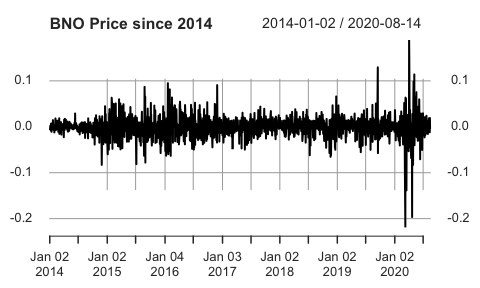
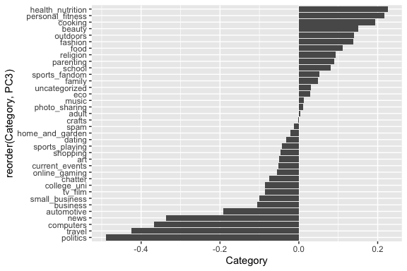
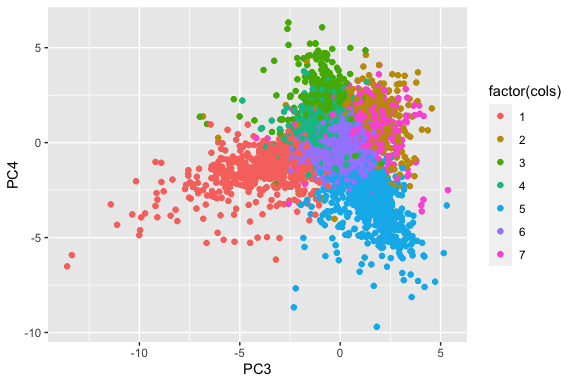

Note: Much of the analysis below was inspired by various R files written
by Professor James Scott.  
\# **Problem 1: Visual story telling: green buildings**

It does make sense to use the median rather than mean as the non-green
buildings have many outliers as suggested by the boxplot below

The stats guru is right about removing buildings with less than 10%
occupancy as based on the summary below. Within the group of buildings
that have only 10% occupancy, there is only one building with a green
rating. In addition, roughly half of the buildings have 3 stories and
very few buildings have a Class A designation. Hence we should remove
buildings with less than 10% occupancy as it may distort the analysis.

    ##  CS_PropertyID        cluster            size           empl_gr      
    ##  Min.   :     57   Min.   :   8.0   Min.   :  1624   Min.   :-1.490  
    ##  1st Qu.: 239800   1st Qu.: 256.0   1st Qu.: 11661   1st Qu.: 1.740  
    ##  Median : 393481   Median : 371.0   Median : 40000   Median : 2.300  
    ##  Mean   :1084028   Mean   : 536.2   Mean   : 62209   Mean   : 3.884  
    ##  3rd Qu.: 819966   3rd Qu.:1002.0   3rd Qu.: 83770   3rd Qu.: 3.700  
    ##  Max.   :6008486   Max.   :1230.0   Max.   :427383   Max.   :67.780  
    ##                                                      NA's   :1       
    ##       Rent         leasing_rate      stories            age         renovated
    ##  Min.   :  7.00   Min.   :0.000   Min.   : 1.000   Min.   :  0.00   0:148    
    ##  1st Qu.: 16.23   1st Qu.:0.000   1st Qu.: 2.000   1st Qu.: 28.00   1: 67    
    ##  Median : 20.50   Median :0.000   Median : 3.000   Median : 57.00            
    ##  Mean   : 22.44   Mean   :1.280   Mean   : 4.819   Mean   : 54.42            
    ##  3rd Qu.: 27.00   3rd Qu.:0.375   3rd Qu.: 6.000   3rd Qu.: 85.00            
    ##  Max.   :111.11   Max.   :9.780   Max.   :19.000   Max.   :118.00            
    ##                                                                              
    ##  class_a    class_b            LEED     Energystar       green_rating
    ##  0:193   Min.   :0.0000   Min.   :0   Min.   :0.000000   0:214       
    ##  1: 22   1st Qu.:0.0000   1st Qu.:0   1st Qu.:0.000000   1:  1       
    ##          Median :0.0000   Median :0   Median :0.000000               
    ##          Mean   :0.4884   Mean   :0   Mean   :0.004651               
    ##          3rd Qu.:1.0000   3rd Qu.:0   3rd Qu.:0.000000               
    ##          Max.   :1.0000   Max.   :0   Max.   :1.000000               
    ##                                                                      
    ##       net           amenities  cd_total_07     hd_total07    total_dd_07  
    ##  Min.   :0.000000   0:189     Min.   : 130   Min.   :   0   Min.   :2103  
    ##  1st Qu.:0.000000   1: 26     1st Qu.: 684   1st Qu.:1419   1st Qu.:2869  
    ##  Median :0.000000             Median :1113   Median :2472   Median :4854  
    ##  Mean   :0.004651             Mean   :1676   Mean   :3141   Mean   :4816  
    ##  3rd Qu.:0.000000             3rd Qu.:2746   3rd Qu.:4916   3rd Qu.:6546  
    ##  Max.   :1.000000             Max.   :5240   Max.   :7200   Max.   :8244  
    ##                                                                           
    ##  Precipitation     Gas_Costs        Electricity_Costs  cluster_rent  
    ##  Min.   :10.46   Min.   :0.009487   Min.   :0.01782   Min.   :10.22  
    ##  1st Qu.:22.71   1st Qu.:0.010118   1st Qu.:0.02453   1st Qu.:18.05  
    ##  Median :25.55   Median :0.010296   Median :0.02887   Median :20.74  
    ##  Mean   :30.34   Mean   :0.011579   Mean   :0.03111   Mean   :23.99  
    ##  3rd Qu.:41.32   3rd Qu.:0.012117   3rd Qu.:0.03781   3rd Qu.:27.02  
    ##  Max.   :58.02   Max.   :0.028914   Max.   :0.06278   Max.   :65.94  
    ## 

The median rent for green buildings and non-green buildings is correct
if buildings with more than 10% occupancy rate are considered.

    ## `summarise()` ungrouping output (override with `.groups` argument)

    ## # A tibble: 2 x 2
    ##   green_rating MedianRent
    ##   <fct>             <dbl>
    ## 1 0                  25.0
    ## 2 1                  27.6

Assuming that the building is 250000 square feet, it seems that the
stats guru is correct about recuperating the costs in a little under 8
years.

**Confounding variables investigation**  

**Renovated Buildings**  
Based on the numerical summary analysis for buildings that are
renovated, it does not seem there is much confounding going on as the
median rents for non renovated and renovated buildings are similar
especially for green buildings

    ## `summarise()` regrouping output by 'renovated' (override with `.groups` argument)

    ## # A tibble: 4 x 3
    ## # Groups:   renovated [2]
    ##   renovated green_rating MedianRent
    ##   <fct>     <fct>             <dbl>
    ## 1 0         0                  27  
    ## 2 0         1                  27.6
    ## 3 1         0                  23.5
    ## 4 1         1                  27.0

    ## `summarise()` ungrouping output (override with `.groups` argument)

    ## # A tibble: 2 x 2
    ##   renovated MedianRent
    ##   <fct>          <dbl>
    ## 1 0               27  
    ## 2 1               23.8

**Number of Stories**  
As suggested by the plot below, the median for stories is a valid
selection since there are some outliers. It looks there is not much
evidence of confounding for the number of stories in the building, even
though there is a slight increase in rent as the number of stories goes
up. The median for stories of green buildings only differs by 1, so
stories may not directly be affecting the rent.

    ## `summarise()` ungrouping output (override with `.groups` argument)

    ## # A tibble: 2 x 2
    ##   green_rating MedianStories
    ##   <fct>                <dbl>
    ## 1 0                       10
    ## 2 1                       11

**Age**  

An initial analysis provides a stark contrast in age between green and
non-green buildings.

However, it looks like there is no confounding for age, as there is no
correlation between the age of the building and the rent from the plot
below.

    ## `summarise()` ungrouping output (override with `.groups` argument)

    ## # A tibble: 2 x 2
    ##   green_rating MedianAge
    ##   <fct>            <dbl>
    ## 1 0                   36
    ## 2 1                   22

**Size**  
It looks like size is definitely a confounding variable, as size is
correlated with rent from plot below and the median size for green
buildings is double that of non-green. Thus, there is a premium in rent
for larger sizes, as expected.

    ## `summarise()` ungrouping output (override with `.groups` argument)

    ## # A tibble: 2 x 2
    ##   green_rating MedianSize
    ##   <fct>             <dbl>
    ## 1 0                123250
    ## 2 1                241199

**Cluster Rent**  
There does not seem to be confounding for cluster rent, as the median
for cluster rent is approximately the same between green and non-green
buildings. However, cluster rent is highly correlated with the rent of
the building.

    ## `summarise()` ungrouping output (override with `.groups` argument)

    ## # A tibble: 2 x 2
    ##   green_rating MedianClusterRent
    ##   <fct>                    <dbl>
    ## 1 0                         25.2
    ## 2 1                         25.4

**Class**  
It looks like the Class designation of buildings is a confounding
variable, as Class A buildings have generally higher median rents - in
addition, having a green\_rating with the Class A designation drives
median rents even higher. Class A designated buildings seem to correlate
with overall rent as well.

    ## `summarise()` regrouping output by 'class_a' (override with `.groups` argument)

    ## # A tibble: 4 x 3
    ## # Groups:   class_a [2]
    ##   class_a green_rating MedianRent
    ##   <fct>   <fct>             <dbl>
    ## 1 0       0                  23.6
    ## 2 0       1                  25.7
    ## 3 1       0                  28.2
    ## 4 1       1                  28.4

    ## `summarise()` ungrouping output (override with `.groups` argument)

    ## # A tibble: 2 x 2
    ##   class_a MedianRent
    ##   <fct>        <dbl>
    ## 1 0             23.9
    ## 2 1             28.2

**Thoughts**  
From the investigation above it seems like size and class are the only
confounding variables, as the green buildings tend to have larger spaces
and larger spaces have higher rent. However, the stats guru is only
taking into account the median rent of all the building with more than
10% occupancy. If we apply another filter to include only 15 story
buildings, we see that the rent goes up drastically for green buildings
- all the way to 37 dollars. However, it may not be wise to use this
filter as there is only 10 green buildings that have 15 stories.

    ## `summarise()` ungrouping output (override with `.groups` argument)

    ## # A tibble: 2 x 3
    ##   green_rating MedianRent   num
    ##   <fct>             <dbl> <int>
    ## 1 0                  24.4   156
    ## 2 1                  37.0    10

In general, the guru is correct with his analysis, but the analysis is
performed on a dataset with a large range of different building
specifications. For example, the dataset only contains 10 green
buildings that have 15 stories. A larger sample size that adheres to the
developers desired specs would provide more valid results.  

**Problem 2: Visual story telling: flights at ABIA**
====================================================

**Most active airlines**  

Here we analyze which airlines are most active throughout the year in
terms of the distance flown. As seen by the plot, it appears Southwest
(WN) and American Airlines(AA) are the most active in flying out of ABIA
and flying to ABIA.

**Delays by Day of Week**  

In the plot below, we analyze the departure and arrival delay for each
day of the week. There are more arrival delays than departure delays and
Friday is the worst day to travel to/from Austin.

**Average Delays per Airline**  

This plot analyzes the average departure and arrival delay for each
airline. It looks like Piedmont Airlines (US) arrives and departs early
on average as the delay time is negative.

**Most common Delay types by Airline**  

Here we analyze the proportions of delays by airlines via the type of
delay. It look like most airlines suffer from carrier and weather
delays.

**Flights per hour of the Day**  

The plot below analyzes what are most frequent departure and arrival
times. Passengers typically fly *out* early in the morning and fly *in*
late at night. Between noon and evening there is an even split between
passengers flying in and out.

**Flights by City**  

The plot below analyzes the top ten airports to which passengers fly to
and fly in from. Dallas and Houston are by far the most popular
destinations.

**Average time spent flying by Airline**  

The plot below analyzes the average time spent flying for each airline.
JetBlue (B6) flies for more than 3 hours on average.

**Actual minus Scheduled Departure Times**  

The plot below analyzes on average how often an airline deviates from
its scheduled departure time. Most airlines leave between 0 to 10
minutes earlier than scheduled!

**Problem 3: Portfolio modeling**
=================================

**Background**  
For this problem, we are analyzing five different ETFs ranging from Gold
ETFs to Oil related ETFs. We chose these ETFs because we wanted to
explore a diverse set of ETFs based on volatility.  

We have chosen to go with 5 ETFs:  
“GLD” - The Fund seeks to achieve the performance of gold bullion less
the expenses of the Fund  

“USO” - The Fund seeks to reflect the performance of the spot price of
West Texas Intermediate light, sweet crude oil delivered to Cushing,
Oklahoma by investing in a mix of Oil Futures Contracts and Other Oil
Interests.  

“VNQ” - The Fund seeks to provide a high level of income and moderate
long-term capital appreciation by tracking the performance of a
benchmark index that measures the performance of publicly traded equity
REITs and other real estate-related investments.  

“BNO” - BNO tracks the Brent oil spot price using near-month ICE futures
contracts.  

“SLV” - The Fund seeks to reflect generally the performance of the price
of silver.  

**Volatility**  
Below are a few plots for the closing prices of ETF. The oil ETFs are
the most volatile of the five funds chosen.

**Portfolios**  
**Portfolio 1** : A portfolio of equal weights to all ETFs (i.e, 20
percent to all ETFs)

    ##       5% 
    ## 9673.958

    ## [1] -391.6459

The 5% value at risk for this particular portfolio is roughly $9,674.
The average return on the portfolio is a loss of $392.  

**Portfolio 2** : A portfolio that invests 96 percent of wealth into
gold and 1 percent into each of the remaining 4 ETFs.

    ##       5% 
    ## 5670.255

    ## [1] 490.9026

The 5% value at risk for this particular portolio is roughly $5,670. The
average return on the portfolio is a profit of $491.  

**Portfolio 3** : A portfolio that invests 60 percent of wealth into VNQ
and 10 percent into each of the remaining 4 ETFs.

    ##       5% 
    ## 7694.568

    ## [1] 226.436

The 5% value at risk of this particular portfolio is roughly $7,695. The
average return on this portfolio is a profit of $226.  

**Report**  
Based on our analysis, portfolio 2 performed the best. By investing 96%
of our wealth into the gold ETF, we were able to achieve the highest
returns and the lowest VaR (value at risk) at 5% between all portfolios.
This is an interesting result as diversification of the portfolio hurt
our investments which suggests that ETFs related to Oil and Silver are
significantly more volatile than Gold. This also suggests that Gold is
typically a safe investment to make.  

**Problem 4: Market Segmentation**  
From the dataset provided by the company “NutrientH20”, we hope to
extract some vital market information regarding the types of followers
that “NutrientH20” has.

We first perform dimension reduction on the dataset to improve
computational ability. In addition, we can visualize the marginal
variance explained by adding another PC. Because the elbow is not clear
in this plot, we choose a value of 15 PCs to continue our analysis.

Based on our understanding of the dataset, we can conclude which PCs are
associated with separating which types of followers. For example, in the
plot below, we can see that the third PC has weights that are strongly
positive for people that are interested in fitness, but not so much in
computers/gaming/politics.

In contrast, our fourth PC (below) has strong negative weights for
health and fitness and seems to value online gaming and sports.

These two PCs, then would be good at separating and visualizing
different types of followers in a 2-Dimensional space.

In order to determine clusters of followers in this space, we perform
kmeans clustering on our points in PC space. To determine the optimal
hyperparameter for clustering, we try several values of *k* and measure
the best one using our within sum of squares as the metric.

Based on the plot, we decided to choose *k* = 7. We can now visualize
the different clusters in the 2D PC space we chose earlier. There seems
to be a clear separation between clusters - those with a higher positive
value for PC3 but low positive value for PC4 are individuals who love
fitness (cluster 5). Those who (we suspect) are college students are
going to be in the positive PC4 range with negative PC3 values (cluster
4).

A closer examination of the clusters as determined by kmeans gives us a
better picture for what type of followers are within this group.

**Problem 5: Author Attribution**  

Using the ReutersC50 dataset, we hoped to fit models that could predict
the author of a particular article based on the article’s textual
content alone.  

**Data Pre-Processing**  

We first needed to ensure that the test and training datasets had the
appropriate format. The datasets need to be formatted into count
matrices, where each *i*, *j* entry represents the number of *j* words
that the *i**t**h* document contains (using
DocumentTermMatrix function from the “tm” package in R).  

Using several pre-processing techniques found in the “tm” package, we
convert each word within each article into lower case. We also strip
each word of numbers, punctuation, and whitespaces, before then creating
the data matrices.  

Since both the training and testing data matrices are sparse, we filter
out terms that have more than 98% sparse terms (0’s). We choose this
filter as it preserves words that specific authors use, which would
benefit our predictions. We use the removeSparseTerms function from the
“tm” package in R.  

Given the filtered dataset, we then convert each *i*, *j* entry into a
TF-IDF score using the weightTfIdf function in the “tm” package.  

In addition, we keep track of which document belongs to which author by
creating an additional vector (for both the test and train datasets)
where the *i**t**h* element of the list is the author of
document *i*.  

Below is a sample of our training dataset:

    ## <<DocumentTermMatrix (documents: 5, terms: 5)>>
    ## Non-/sparse entries: 10/15
    ## Sparsity           : 60%
    ## Maximal term length: 11
    ## Weighting          : term frequency - inverse document frequency (normalized) (tf-idf)
    ## Sample             :
    ##     Terms
    ## Docs     access        also  announced authorities     become
    ##    1 0.03280211 0.006312011 0.02172606  0.03236174 0.02534424
    ##    2 0.00000000 0.010062627 0.01731788  0.00000000 0.00000000
    ##    3 0.17601133 0.000000000 0.00000000  0.00000000 0.00000000
    ##    4 0.00000000 0.000000000 0.01541850  0.00000000 0.00000000
    ##    5 0.00000000 0.000000000 0.01942981  0.00000000 0.00000000

    ## <<DocumentTermMatrix (documents: 5, terms: 5)>>
    ## Non-/sparse entries: 6/19
    ## Sparsity           : 76%
    ## Maximal term length: 10
    ## Weighting          : term frequency (tf)
    ## Sample             :
    ##     Terms
    ## Docs aaron abandon able account accounting
    ##    1     1       1    1       1          3
    ##    2     0       0    0       0          0
    ##    3     0       0    0       0          0
    ##    4     0       0    0       0          0
    ##    5     1       0    0       0          0

We then filter words that are uninformative and appear in every document
(i.e. all entries are 0).

Due to our filtering preference, we found that the words (features)
between the training dataset and testing dataset matched up perfectly.
Because of this, no other steps were needed to fix the features between
the datasets.  

**Dimension Reduction**  

We then perform PCA on our training dataset. To ensure the principal
components between both the training and testing dataset are equivalent,
we project the observations of the test set into the PC space as defined
by our training dataset. We choose the first 500 PCs to improve
computational speed (~85% of variance explained).

**Prediction**  

We use the random forest and k-Nearest Neighbor algorithms to determine
a model for prediction.  

We first try the random forest algorithm on our original dataset, rather
than PC space. We have 725 words, and choose 70 as the number of
variables to consider for each split as well as 500 trees for
computational speed. We were able to achieve a classification accuracy
of approximately 58%. *Note: we drop the feature (word) “next” from the
dataset, as the random forest function throws an error when it
encounters this word.*

    ## randomForest 4.6-14

    ## Type rfNews() to see new features/changes/bug fixes.

    ## 
    ## Attaching package: 'randomForest'

    ## The following object is masked from 'package:ggplot2':
    ## 
    ##     margin

    ## The following object is masked from 'package:dplyr':
    ## 
    ##     combine

    ## [1] 0.5804

In random forest, we chose several hyperparameters that could balance
between bias and variance, while trying to account for computational
speed. We designated a subset of 20 variables for each split, and we
grew 500 trees.

    ## [1] 0.4436

Using the random forest algorithm on our PC space, we were able to
achieve a roughly 44% accuracy on our dataset. While it does reduce our
dimensionality, it also reduces quite a bit of accuracy.  

We then fit a k-Nearest Neighbors model on our training dataset, and
chose to use *k* = 6.

    ## 
    ## Attaching package: 'class'

    ## The following object is masked from 'package:reshape':
    ## 
    ##     condense

In this situation, *k* = 6 provided the best accuracy.  

In general, our random forest model fit on the original dataset (not PC
space) performed the best.

**Problem 6: Association Rule Mining**  
In this problem, we wanted to find association rules within a dataset
containing baskets of grocery shoppers. We first take the necessary data
pre-processing steps to read in the data, as well as format it in a way
that allows the “arules” package in R to work. Below is a summary of the
resulting object from the class “transactions” (also within the “arules”
package).  

In our dataset, we can see that whole milk is purchased in roughly 25%
of the baskets.  

    ## transactions as itemMatrix in sparse format with
    ##  9835 rows (elements/itemsets/transactions) and
    ##  169 columns (items) and a density of 0.02609146 
    ## 
    ## most frequent items:
    ##       whole milk other vegetables       rolls/buns             soda 
    ##             2513             1903             1809             1715 
    ##           yogurt          (Other) 
    ##             1372            34055 
    ## 
    ## element (itemset/transaction) length distribution:
    ## sizes
    ##    1    2    3    4    5    6    7    8    9   10   11   12   13   14   15   16 
    ## 2159 1643 1299 1005  855  645  545  438  350  246  182  117   78   77   55   46 
    ##   17   18   19   20   21   22   23   24   26   27   28   29   32 
    ##   29   14   14    9   11    4    6    1    1    1    1    3    1 
    ## 
    ##    Min. 1st Qu.  Median    Mean 3rd Qu.    Max. 
    ##   1.000   2.000   3.000   4.409   6.000  32.000 
    ## 
    ## includes extended item information - examples:
    ##             labels
    ## 1 abrasive cleaner
    ## 2 artif. sweetener
    ## 3   baby cosmetics

We tested several thresholds for both confidence and lift. In general,
what we were looking for were rules that had a high number of counts (in
terms of the left-hand side of the rule) and high confidence as well as
lift.  

Below is a small sample of our baseline list of rules. We choose a
confidence of 0.1 and a lift of 1. We choose a max length of 3 in order
to find more general rules, instead of finding rules with larger lengths
that may not occur as often. In total, there are 18597 rules.

    ##      lhs                    rhs                support     confidence
    ## [1]  {}                  => {yogurt}           0.139501779 0.1395018 
    ## [2]  {}                  => {rolls/buns}       0.183934926 0.1839349 
    ## [3]  {honey}             => {whole milk}       0.001118454 0.7333333 
    ## [4]  {soap}              => {whole milk}       0.001118454 0.4230769 
    ## [5]  {tidbits}           => {soda}             0.001016777 0.4347826 
    ## [6]  {tidbits}           => {rolls/buns}       0.001220132 0.5217391 
    ## [7]  {cocoa drinks}      => {whole milk}       0.001321810 0.5909091 
    ## [8]  {snack products}    => {soda}             0.001118454 0.3666667 
    ## [9]  {snack products}    => {rolls/buns}       0.001118454 0.3666667 
    ## [10] {pudding powder}    => {whole milk}       0.001321810 0.5652174 
    ## [11] {cooking chocolate} => {whole milk}       0.001321810 0.5200000 
    ## [12] {bathroom cleaner}  => {soda}             0.001016777 0.3703704 
    ## [13] {bathroom cleaner}  => {other vegetables} 0.001016777 0.3703704 
    ## [14] {nuts/prunes}       => {rolls/buns}       0.001016777 0.3030303 
    ## [15] {nuts/prunes}       => {whole milk}       0.001220132 0.3636364 
    ## [16] {brandy}            => {shopping bags}    0.001321810 0.3170732 
    ## [17] {brandy}            => {rolls/buns}       0.001118454 0.2682927 
    ## [18] {nut snack}         => {soda}             0.001016777 0.3225806 
    ## [19] {potato products}   => {pastry}           0.001016777 0.3571429 
    ## [20] {potato products}   => {whole milk}       0.001220132 0.4285714 
    ##      coverage    lift     count
    ## [1]  1.000000000 1.000000 1372 
    ## [2]  1.000000000 1.000000 1809 
    ## [3]  0.001525165 2.870009   11 
    ## [4]  0.002643620 1.655775   11 
    ## [5]  0.002338587 2.493345   10 
    ## [6]  0.002338587 2.836542   12 
    ## [7]  0.002236909 2.312611   13 
    ## [8]  0.003050330 2.102721   11 
    ## [9]  0.003050330 1.993459   11 
    ## [10] 0.002338587 2.212062   13 
    ## [11] 0.002541942 2.035097   13 
    ## [12] 0.002745297 2.123961   10 
    ## [13] 0.002745297 1.914132   10 
    ## [14] 0.003355363 1.647486   10 
    ## [15] 0.003355363 1.423145   12 
    ## [16] 0.004168785 3.218178   13 
    ## [17] 0.004168785 1.458628   11 
    ## [18] 0.003152008 1.849901   10 
    ## [19] 0.002846975 4.014286   10 
    ## [20] 0.002846975 1.677278   12

In addition, from the graph, we can see by increasing the confidence (as
well as reducing the minimum support required), we can see a drastic
decrease in the number of rules in our list. These rules are generally
good, because they have high count and have a good level of confidence.

    ## Apriori
    ## 
    ## Parameter specification:
    ##  confidence minval smax arem  aval originalSupport maxtime support minlen
    ##         0.3    0.1    1 none FALSE            TRUE       5    0.05      1
    ##  maxlen target  ext
    ##       3  rules TRUE
    ## 
    ## Algorithmic control:
    ##  filter tree heap memopt load sort verbose
    ##     0.1 TRUE TRUE  FALSE TRUE    2    TRUE
    ## 
    ## Absolute minimum support count: 491 
    ## 
    ## set item appearances ...[0 item(s)] done [0.00s].
    ## set transactions ...[169 item(s), 9835 transaction(s)] done [0.00s].
    ## sorting and recoding items ... [28 item(s)] done [0.00s].
    ## creating transaction tree ... done [0.00s].
    ## checking subsets of size 1 2 done [0.00s].
    ## writing ... [3 rule(s)] done [0.00s].
    ## creating S4 object  ... done [0.00s].

    ##     lhs                   rhs          support    confidence coverage  lift    
    ## [1] {yogurt}           => {whole milk} 0.05602440 0.4016035  0.1395018 1.571735
    ## [2] {rolls/buns}       => {whole milk} 0.05663447 0.3079049  0.1839349 1.205032
    ## [3] {other vegetables} => {whole milk} 0.07483477 0.3867578  0.1934926 1.513634
    ##     count
    ## [1] 551  
    ## [2] 557  
    ## [3] 736

By decreasing the required minimum support again, we can achieve a
slightly larger list (size 37) of rules. However, in general, the counts
for each rule is low (around 200 each rule).  

Using the same rules, we can filter out the items that have a high value
for lift. In general, since lift is high, it implies that the items on
either side of the rule are not independent from one another (i.e. they
are complementary). An interesting rule to note on this list is the
second rule - the count is high and the confidence is good. It also
makes sense - typically, when a shopper is buying vegetables, they
probably won’t just stop at root vegetables.

    ## Apriori
    ## 
    ## Parameter specification:
    ##  confidence minval smax arem  aval originalSupport maxtime support minlen
    ##         0.3    0.1    1 none FALSE            TRUE       5    0.02      1
    ##  maxlen target  ext
    ##       3  rules TRUE
    ## 
    ## Algorithmic control:
    ##  filter tree heap memopt load sort verbose
    ##     0.1 TRUE TRUE  FALSE TRUE    2    TRUE
    ## 
    ## Absolute minimum support count: 196 
    ## 
    ## set item appearances ...[0 item(s)] done [0.00s].
    ## set transactions ...[169 item(s), 9835 transaction(s)] done [0.00s].
    ## sorting and recoding items ... [59 item(s)] done [0.00s].
    ## creating transaction tree ... done [0.00s].
    ## checking subsets of size 1 2 3

    ## Warning in apriori(baskets.trans, parameter = list(support = 0.02, confidence
    ## = 0.3, : Mining stopped (maxlen reached). Only patterns up to a length of 3
    ## returned!

    ##  done [0.00s].
    ## writing ... [37 rule(s)] done [0.00s].
    ## creating S4 object  ... done [0.00s].

    ##     lhs                              rhs                support    confidence
    ## [1] {whipped/sour cream}          => {other vegetables} 0.02887646 0.4028369 
    ## [2] {root vegetables}             => {other vegetables} 0.04738180 0.4347015 
    ## [3] {root vegetables,whole milk}  => {other vegetables} 0.02318251 0.4740125 
    ## [4] {other vegetables,whole milk} => {root vegetables}  0.02318251 0.3097826 
    ## [5] {other vegetables,yogurt}     => {whole milk}       0.02226741 0.5128806 
    ## [6] {whole milk,yogurt}           => {other vegetables} 0.02226741 0.3974592 
    ##     coverage   lift     count
    ## [1] 0.07168277 2.081924 284  
    ## [2] 0.10899847 2.246605 466  
    ## [3] 0.04890696 2.449770 228  
    ## [4] 0.07483477 2.842082 228  
    ## [5] 0.04341637 2.007235 219  
    ## [6] 0.05602440 2.054131 219

We then reduced the minimum required support even further and increased
the maximum length of each rule. In general, most of these rules are
good (if we disregard the low count). They all have lifts greater than
2, which is indicative of their possible non-independence.

    ## Apriori
    ## 
    ## Parameter specification:
    ##  confidence minval smax arem  aval originalSupport maxtime support minlen
    ##         0.3    0.1    1 none FALSE            TRUE       5    0.01      1
    ##  maxlen target  ext
    ##       4  rules TRUE
    ## 
    ## Algorithmic control:
    ##  filter tree heap memopt load sort verbose
    ##     0.1 TRUE TRUE  FALSE TRUE    2    TRUE
    ## 
    ## Absolute minimum support count: 98 
    ## 
    ## set item appearances ...[0 item(s)] done [0.00s].
    ## set transactions ...[169 item(s), 9835 transaction(s)] done [0.00s].
    ## sorting and recoding items ... [88 item(s)] done [0.00s].
    ## creating transaction tree ... done [0.00s].
    ## checking subsets of size 1 2 3 4

    ## Warning in apriori(baskets.trans, parameter = list(support = 0.01, confidence
    ## = 0.3, : Mining stopped (maxlen reached). Only patterns up to a length of 4
    ## returned!

    ##  done [0.00s].
    ## writing ... [125 rule(s)] done [0.00s].
    ## creating S4 object  ... done [0.00s].

    ##      lhs                        rhs                   support confidence   coverage     lift count
    ## [1]  {onions}                => {other vegetables} 0.01423488  0.4590164 0.03101169 2.372268   140
    ## [2]  {berries}               => {yogurt}           0.01057448  0.3180428 0.03324860 2.279848   104
    ## [3]  {hamburger meat}        => {other vegetables} 0.01382816  0.4159021 0.03324860 2.149447   136
    ## [4]  {cream cheese }         => {yogurt}           0.01240468  0.3128205 0.03965430 2.242412   122
    ## [5]  {chicken}               => {other vegetables} 0.01789527  0.4170616 0.04290798 2.155439   176
    ## [6]  {beef}                  => {root vegetables}  0.01738688  0.3313953 0.05246568 3.040367   171
    ## [7]  {curd}                  => {yogurt}           0.01728521  0.3244275 0.05327911 2.325615   170
    ## [8]  {whipped/sour cream}    => {other vegetables} 0.02887646  0.4028369 0.07168277 2.081924   284
    ## [9]  {root vegetables}       => {other vegetables} 0.04738180  0.4347015 0.10899847 2.246605   466
    ## [10] {curd,                                                                                       
    ##       yogurt}                => {whole milk}       0.01006609  0.5823529 0.01728521 2.279125    99
    ## [11] {curd,                                                                                       
    ##       whole milk}            => {yogurt}           0.01006609  0.3852140 0.02613116 2.761356    99
    ## [12] {pork,                                                                                       
    ##       whole milk}            => {other vegetables} 0.01016777  0.4587156 0.02216573 2.370714   100
    ## [13] {butter,                                                                                     
    ##       other vegetables}      => {whole milk}       0.01148958  0.5736041 0.02003050 2.244885   113
    ## [14] {butter,                                                                                     
    ##       whole milk}            => {other vegetables} 0.01148958  0.4169742 0.02755465 2.154987   113
    ## [15] {domestic eggs,                                                                              
    ##       other vegetables}      => {whole milk}       0.01230300  0.5525114 0.02226741 2.162336   121
    ## [16] {domestic eggs,                                                                              
    ##       whole milk}            => {other vegetables} 0.01230300  0.4101695 0.02999492 2.119820   121
    ## [17] {fruit/vegetable juice,                                                                      
    ##       whole milk}            => {other vegetables} 0.01047280  0.3931298 0.02663955 2.031756   103
    ## [18] {whipped/sour cream,                                                                         
    ##       yogurt}                => {other vegetables} 0.01016777  0.4901961 0.02074225 2.533410   100
    ## [19] {other vegetables,                                                                           
    ##       whipped/sour cream}    => {yogurt}           0.01016777  0.3521127 0.02887646 2.524073   100
    ## [20] {whipped/sour cream,                                                                         
    ##       yogurt}                => {whole milk}       0.01087951  0.5245098 0.02074225 2.052747   107
    ## [21] {whipped/sour cream,                                                                         
    ##       whole milk}            => {yogurt}           0.01087951  0.3375394 0.03223183 2.419607   107
    ## [22] {whipped/sour cream,                                                                         
    ##       whole milk}            => {other vegetables} 0.01464159  0.4542587 0.03223183 2.347679   144
    ## [23] {other vegetables,                                                                           
    ##       pip fruit}             => {whole milk}       0.01352313  0.5175097 0.02613116 2.025351   133
    ## [24] {pip fruit,                                                                                  
    ##       whole milk}            => {other vegetables} 0.01352313  0.4493243 0.03009659 2.322178   133
    ## [25] {citrus fruit,                                                                               
    ##       root vegetables}       => {other vegetables} 0.01037112  0.5862069 0.01769192 3.029608   102
    ## [26] {citrus fruit,                                                                               
    ##       other vegetables}      => {root vegetables}  0.01037112  0.3591549 0.02887646 3.295045   102
    ## [27] {citrus fruit,                                                                               
    ##       whole milk}            => {yogurt}           0.01026945  0.3366667 0.03050330 2.413350   101
    ## [28] {citrus fruit,                                                                               
    ##       whole milk}            => {other vegetables} 0.01301474  0.4266667 0.03050330 2.205080   128
    ## [29] {root vegetables,                                                                            
    ##       tropical fruit}        => {other vegetables} 0.01230300  0.5845411 0.02104728 3.020999   121
    ## [30] {other vegetables,                                                                           
    ##       tropical fruit}        => {root vegetables}  0.01230300  0.3427762 0.03589222 3.144780   121
    ## [31] {root vegetables,                                                                            
    ##       tropical fruit}        => {whole milk}       0.01199797  0.5700483 0.02104728 2.230969   118
    ## [32] {tropical fruit,                                                                             
    ##       yogurt}                => {other vegetables} 0.01230300  0.4201389 0.02928317 2.171343   121
    ## [33] {other vegetables,                                                                           
    ##       tropical fruit}        => {yogurt}           0.01230300  0.3427762 0.03589222 2.457146   121
    ## [34] {tropical fruit,                                                                             
    ##       yogurt}                => {whole milk}       0.01514997  0.5173611 0.02928317 2.024770   149
    ## [35] {tropical fruit,                                                                             
    ##       whole milk}            => {yogurt}           0.01514997  0.3581731 0.04229792 2.567516   149
    ## [36] {tropical fruit,                                                                             
    ##       whole milk}            => {other vegetables} 0.01708185  0.4038462 0.04229792 2.087140   168
    ## [37] {root vegetables,                                                                            
    ##       yogurt}                => {other vegetables} 0.01291307  0.5000000 0.02582613 2.584078   127
    ## [38] {root vegetables,                                                                            
    ##       yogurt}                => {whole milk}       0.01453991  0.5629921 0.02582613 2.203354   143
    ## [39] {rolls/buns,                                                                                 
    ##       root vegetables}       => {other vegetables} 0.01220132  0.5020921 0.02430097 2.594890   120
    ## [40] {rolls/buns,                                                                                 
    ##       root vegetables}       => {whole milk}       0.01270971  0.5230126 0.02430097 2.046888   125
    ## [41] {root vegetables,                                                                            
    ##       whole milk}            => {other vegetables} 0.02318251  0.4740125 0.04890696 2.449770   228
    ## [42] {other vegetables,                                                                           
    ##       whole milk}            => {root vegetables}  0.02318251  0.3097826 0.07483477 2.842082   228
    ## [43] {other vegetables,                                                                           
    ##       yogurt}                => {whole milk}       0.02226741  0.5128806 0.04341637 2.007235   219
    ## [44] {whole milk,                                                                                 
    ##       yogurt}                => {other vegetables} 0.02226741  0.3974592 0.05602440 2.054131   219

We then looked for substitute items. After reducing support and maximum
length slightly, we found an interesting set of rules that depicted
this. In general, we believe that it’s safe to assume that most people
who go shopping are not there to buy shopping bags, but rather are there
to buy whole milk.  

    ## Apriori
    ## 
    ## Parameter specification:
    ##  confidence minval smax arem  aval originalSupport maxtime support minlen
    ##        0.01    0.1    1 none FALSE            TRUE       5   0.005      1
    ##  maxlen target  ext
    ##       3  rules TRUE
    ## 
    ## Algorithmic control:
    ##  filter tree heap memopt load sort verbose
    ##     0.1 TRUE TRUE  FALSE TRUE    2    TRUE
    ## 
    ## Absolute minimum support count: 49 
    ## 
    ## set item appearances ...[0 item(s)] done [0.00s].
    ## set transactions ...[169 item(s), 9835 transaction(s)] done [0.00s].
    ## sorting and recoding items ... [120 item(s)] done [0.00s].
    ## creating transaction tree ... done [0.00s].
    ## checking subsets of size 1 2 3

    ## Warning in apriori(baskets.trans, parameter = list(support = 0.005, confidence
    ## = 0.01, : Mining stopped (maxlen reached). Only patterns up to a length of 3
    ## returned!

    ##  done [0.00s].
    ## writing ... [2090 rule(s)] done [0.00s].
    ## creating S4 object  ... done [0.00s].

    ##     lhs                rhs             support    confidence coverage  
    ## [1] {shopping bags} => {whole milk}    0.02450432 0.24871001 0.09852567
    ## [2] {whole milk}    => {shopping bags} 0.02450432 0.09590131 0.25551601
    ##     lift      count
    ## [1] 0.9733637 241  
    ## [2] 0.9733637 241

In general, most of the rules make sense. Root vegetables aren’t going
to be the only vegetables you buy, you’ll probably buy other vegetables.
If you’re getting yogurt, you’re going to be in the dairy section, so
you’ll probably pick up some milk too. And finally, if you’re going to
make a sandwich, you’ll probably need both white bread and ham.
